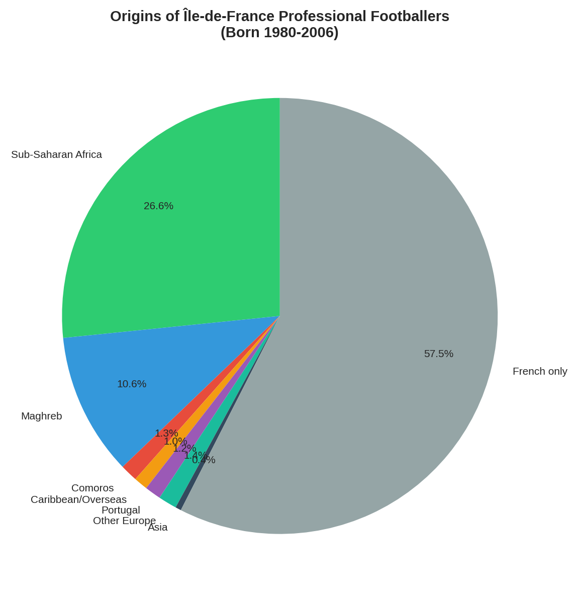
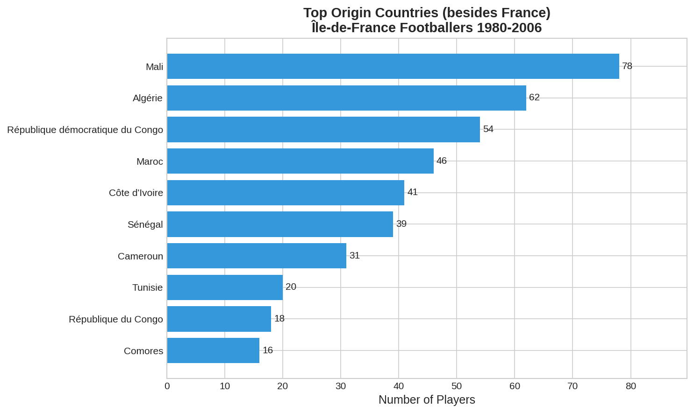
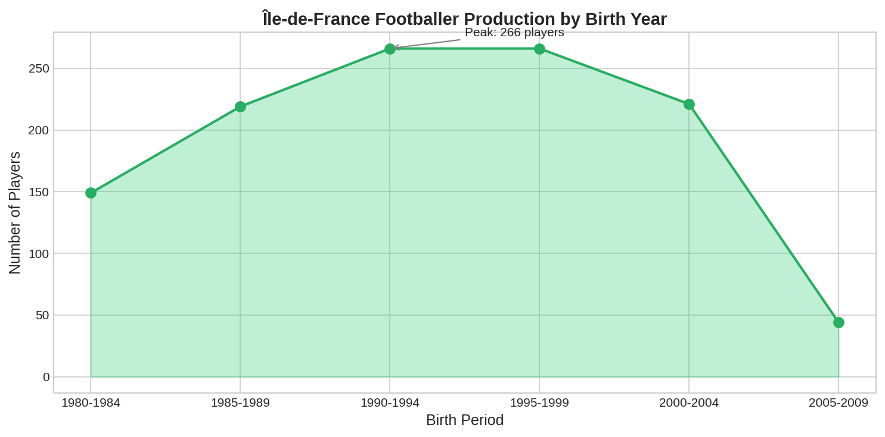

# PSG Diaspora Dataset

**Analyzing the relationship between Île-de-France demographics, migration history, and football talent production**

[](https://huggingface.co/datasets/ldiaby/idf-footballers)
[](LICENSE)
[](https://www.python.org/downloads/)

## Key Findings

| Metric | Value |
|--------|-------|
| Professional footballers (1980-2006) | **1,165** |
| Dual nationals | **39.4%** |
| African diaspora background | **42.5%** |
| Top diaspora origins | Mali (78), Algeria (62), DR Congo (54), Morocco (46) |

All 8 Île-de-France départements are now included in the dataset.

## Visualizations

### Diaspora Distribution


### Top Origin Countries


### Birth Year Trends


*More charts available in `docs/figures/`*

## Project Overview

This project aims to empirically test claims about the exceptional nature of the Île-de-France football "vivier" (talent pool) and its relationship to migration patterns. Rather than accepting intuitive narratives, we build a data-driven analysis.

## Research Questions

### Primary Questions
1. **Is Île-de-France truly exceptional?** How does it compare quantitatively to other major football talent pools (Greater London, São Paulo, Buenos Aires, Randstad)?
2. **What factors explain talent production?** Is it migration, urban density, infrastructure, club investment, or a combination?
3. **How has PSG's formation strategy evolved?** Can we measure the "Titis" integration rate over time?

### Secondary Questions
4. What is the geographic distribution of PSG-trained players' birthplaces?
5. How does media discourse frame young Francilien players? (NLP analysis)
6. What are the international trajectories of Île-de-France trained players?

## Methodological Challenges

| Challenge | Mitigation Strategy |
|-----------|---------------------|
| **Selection bias** - Only successful players visible | Track full academy cohorts, not just pros |
| **Correlation vs causation** - Migration linked to talent? | Include control variables (density, infrastructure, club budgets) |
| **Definition ambiguity** - What is a "Francilien" player? | Clear taxonomy: birthplace vs training location vs residence |
| **Data availability** - Limited public data on youth players | Multiple sources, transparency about gaps |
| **Confirmation bias** - Finding what we expect | Pre-registered hypotheses, blind analysis where possible |

## Data Sources

### Players Data
- **Transfermarkt** - Player profiles, career history, market values
- **FBRef** - Performance statistics
- **Wikipedia/Wikidata** - Biographical data, birthplaces
- **FFF (French Football Federation)** - Licensed players by region
- **Sofascore/Fotmob** - Match data

### Demographic Data
- **INSEE** - Population, migration statistics by département
- **INED** - Historical migration data
- **OpenStreetMap** - Football infrastructure geolocation

### Media Corpus
- **L'Équipe, Le Parisien, So Foot** - Articles about young players
- **Social media** - Twitter/X mentions (with ethical considerations)

## Project Structure

```
psg-diaspora-dataset/
├── data/
│   ├── raw/              # Unprocessed data from sources
│   ├── processed/        # Cleaned, structured datasets
│   └── external/         # Third-party datasets (INSEE, etc.)
├── notebooks/            # Jupyter notebooks for exploration
├── src/
│   ├── collectors/       # Data collection scripts
│   ├── analysis/         # Statistical analysis
│   ├── nlp/              # Media discourse analysis
│   └── visualization/    # Maps, charts, dashboards
├── tests/                # Unit tests
├── docs/                 # Documentation
└── config/               # Configuration files
```

## Hypotheses to Test

### H1: Density Hypothesis
> Football talent production correlates more strongly with urban density than with migration rates.

### H2: Infrastructure Hypothesis
> Number of football clubs and city-stades per capita is a stronger predictor than demographic composition.

### H3: PSG Effect Hypothesis
> Post-2022 PSG strategy has increased retention of local talents (fewer early departures to foreign clubs).

### H4: Media Framing Hypothesis
> Media discourse about Francilien players emphasizes "quartiers" and "diversity" more than technical qualities.

## Technical Stack

- **Python 3.11+**
- **Data collection**: `requests`, `beautifulsoup4`, `scrapy`
- **Data processing**: `pandas`, `polars`
- **Geospatial**: `geopandas`, `folium`, `keplergl`
- **NLP**: `spacy`, `transformers`, `sentence-transformers`
- **Visualization**: `plotly`, `altair`, `matplotlib`
- **Database**: `duckdb` (local), `postgresql` (optional)

## Quick Start

```bash
# Clone the repo
git clone https://github.com/ldiaby/psg-diaspora-dataset.git
cd psg-diaspora-dataset

# Setup environment
python -m venv venv
source venv/bin/activate
pip install -r requirements.txt

# Run analysis on existing data
python src/analysis/analyze_players.py

# Generate visualizations
python src/visualization/charts.py

# Explore in Jupyter
jupyter notebook notebooks/01_data_exploration.ipynb
```

## Data Collection

```bash
# Collect from Wikidata (1,165 players from all 8 départements)
python src/collectors/wikidata.py
```

## Ethical Considerations

- **Privacy**: No personal data on minors beyond public sports records
- **Bias awareness**: Acknowledge limitations in data and methodology
- **No determinism**: Correlation analysis, not causal claims about individuals
- **Respect**: Players are people, not data points

## License

MIT License - See LICENSE file

## Author

Lamine DIABY

## References

- INSEE - Statistiques démographiques Île-de-France
- INED - Histoire des migrations en France
- Ligue Paris Île-de-France de Football
- Academic literature on sports sociology (to be documented)
